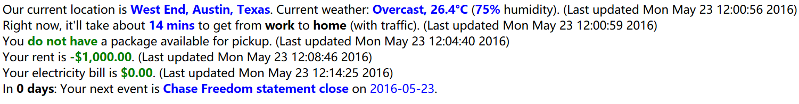

# Vega
**Vega** is a framework for displaying output of scripts and calendars on a webpage. I use it to monitor my home!


### Task flow
Writing a task with Vega has a few parts which all end with dropping your task file in the `tasks/` directory.

#### If you need a browser
* Import `BrowserTask`.
* Write a `run_func` that tells your browser what to do. It should return a result and a color (e.g. red is BAD!)
* If your task involves logging in somewhere, you can get your credentials out of sqlite by using `get_creds(url)` (see below).
* Write a `humanized_template`, which is a string template with a space for your result to be inserted (denoted by `%s`).
* End with running your task and committing the results. 

**Boilerplate example**
```python
from tasks.browser_task import BrowserTask

TEMPLATE = "The result of my task is %s. Whoo! :3"
def run(browser):
    # Do something, e.g.
    url = "https://google.com"
    browser.get(url)
    text = "Google is up!"
    return (text, "green")
task = BrowserTask(name = task, run_func = run, humanized_template = TEMPLATE)
task.run()
task.commit()
```

### If you don't need a browser
* Import `ScriptTask`.
* Write a `run_func` that performs your task. It should return a result and a color (e.g. red is BAD!)
* Write a `humanized_template`, which is a string template with a space for your result to be inserted (denoted by `%s`).
* End with running your task and committing the results. 

**Boilerplate example**

```python
from tasks.script_task import ScriptTask

TEMPLATE = "The result of my task is %s. Whoo! :3"
def run():
    # Do something, e.g.
    text = ""
    system("echo 'Myeh!' > someFile")
    with open("someFile") as f:
        text = f.read()
    return (text, "green")
task = ScriptTask(name = task, run_func = run, humanized_template = TEMPLATE)
task.run()
task.commit_result()
```

### Installation
Vega requires **PhantomJS** to be located in your path.

```
pip3 install icalendar requests selenium==2.48
```
